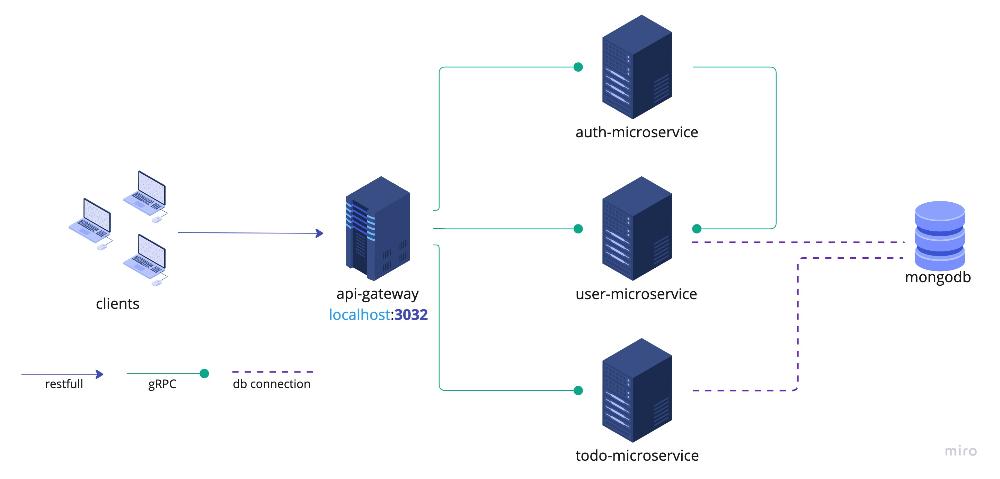

# Nestjs + gRPC example

>Hello! ✋
> 
>I have been searching for an example project that utilizes gRPC with NestJS, but I have not been able to find a detailed one. Therefore, I have created this repository to provide an example for using gRPC.
>This project is a simple todo app, and I have implemented gRPC for my microservices. You can find more details about the architecture in the image

## Architecture
<p align="center">
  
</p>


## Postman document link

> https://documenter.getpostman.com/view/10504693/2s8YYFrPm1

### To run
```bash
$ docker-compose up
```

### To run tests
```bash
$ npm run test
```

### To stop project
```bash
$ docker-compose down
```

###

#### Proto files
> You can find my proto files in libs/grpc-types/src/protos
> I have three proto file; user,auth and todo proto file. each my microservice service has its own proto file. 

#### Logger
> If you're looking for logger example for your gRPC microservices you would want to look my interceptors folder
> it's in libs/interceptors folder.
